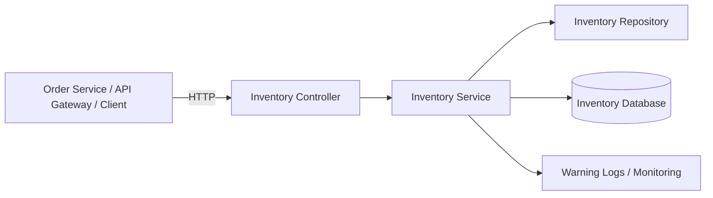
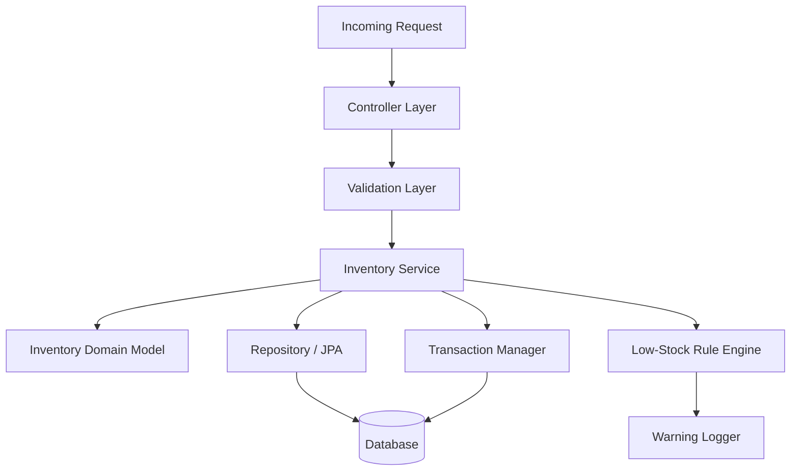
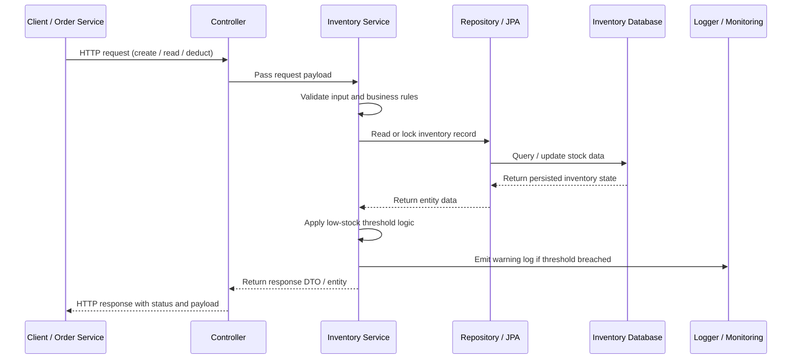
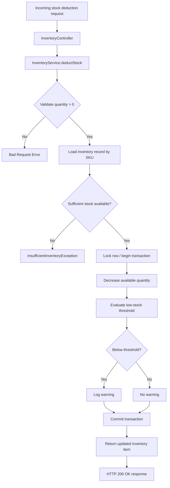
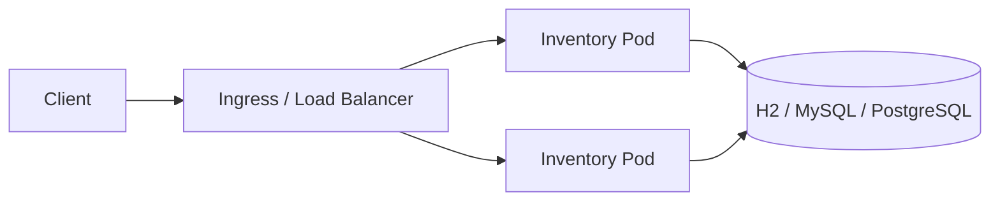

# Inventory Management Service

This module implements the inventory microservice for the order-management system.

## 1. Architecture Overview

The inventory service is responsible for managing stock information for products, validating stock availability, and applying stock deduction requests from the order service. It acts as the source of truth for inventory data in the distributed system.

### Core responsibilities
- Store product inventory records by SKU
- Track available quantity and low-stock state
- Handle stock deduction requests safely
- Emit warning logs when stock falls below a configured threshold
- Expose REST endpoints for inventory queries and updates

## 2. High-Level Component Diagram



## 3. Detailed Internal Architecture



## 4. End-to-End Request Flow (Request to Response)



### Detailed flow for stock deduction



## 5. Main Components

### Controller Layer
- Handles create, read, and deduct endpoints
- Provides a clean REST interface for other services

### Service Layer
- Implements business logic for stock updates
- Ensures inventory is not deducted below zero
- Applies low-stock threshold evaluation

### Repository Layer
- Stores inventory records in a relational database
- Uses transactional database operations for consistency

### Domain Model
- Inventory item contains:
  - SKU
  - product name
  - available quantity
  - low-stock flag
  - timestamps

## 6. Deployment Architecture



## 7. Design Considerations

- Horizontal scaling with multiple replicas
- Transactional updates for consistency
- Low-stock threshold controlled through configuration
- Containerization with Docker and Kubernetes
- Future readiness for API gateway and service discovery

## 8. Current Implementation Notes

- Built with Spring Boot and Spring Data JPA
- Default local profile uses H2 in-memory database
- Low-stock threshold is configurable via application configuration
- Kubernetes ConfigMap is included for deployment-time property injection

## 9. API Endpoints

- POST /api/inventory
- GET /api/inventory/{sku}
- POST /api/inventory/deduct

## 10. Run and Deploy

### Run locally
```bash
./mvnw spring-boot:run
```

### Build image
```bash
docker build -t inventory-service:latest .
```

### Deploy to Kubernetes
```bash
kubectl apply -f k8s/configmap.yaml
kubectl apply -f k8s/deployment.yaml
kubectl apply -f k8s/service.yaml
```
